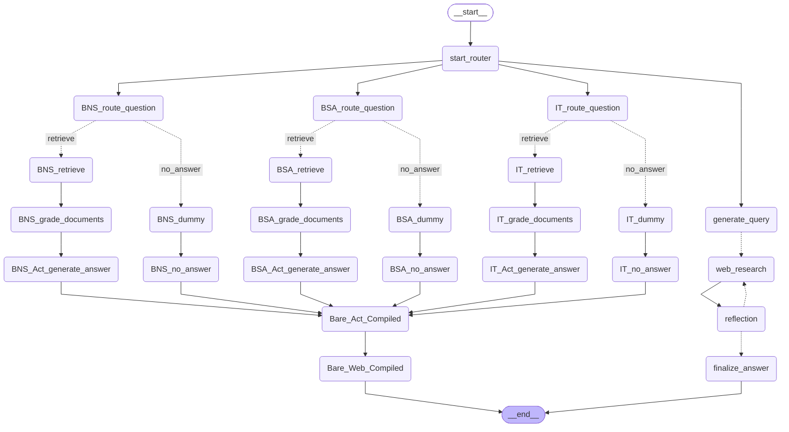

```mermaid
---
config:
  flowchart:
    curve: linear
---
graph TD;
	__start__([<p>__start__</p>]):::first
	start_router(start_router)
	generate_query(generate_query)
	web_research(web_research)
	reflection(reflection)
	finalize_answer(finalize_answer)
	IT_route_question(IT_route_question)
	IT_retrieve(IT_retrieve)
	IT_grade_documents(IT_grade_documents)
	IT_Act_generate_answer(IT_Act_generate_answer)
	IT_no_answer(IT_no_answer)
	IT_dummy(IT_dummy)
	BNS_route_question(BNS_route_question)
	BNS_retrieve(BNS_retrieve)
	BNS_grade_documents(BNS_grade_documents)
	BNS_Act_generate_answer(BNS_Act_generate_answer)
	BNS_no_answer(BNS_no_answer)
	BNS_dummy(BNS_dummy)
	BSA_route_question(BSA_route_question)
	BSA_retrieve(BSA_retrieve)
	BSA_grade_documents(BSA_grade_documents)
	BSA_Act_generate_answer(BSA_Act_generate_answer)
	BSA_no_answer(BSA_no_answer)
	BSA_dummy(BSA_dummy)
	Bare_Act_Compiled(Bare_Act_Compiled)
	Bare_Web_Compiled(Bare_Web_Compiled)
	__end__([<p>__end__</p>]):::last
	BNS_Act_generate_answer --> Bare_Act_Compiled;
	BNS_dummy --> BNS_no_answer;
	BNS_grade_documents --> BNS_Act_generate_answer;
	BNS_no_answer --> Bare_Act_Compiled;
	BNS_retrieve --> BNS_grade_documents;
	BNS_route_question -. &nbsp;no_answer&nbsp; .-> BNS_dummy;
	BNS_route_question -. &nbsp;retrieve&nbsp; .-> BNS_retrieve;
	BSA_Act_generate_answer --> Bare_Act_Compiled;
	BSA_dummy --> BSA_no_answer;
	BSA_grade_documents --> BSA_Act_generate_answer;
	BSA_no_answer --> Bare_Act_Compiled;
	BSA_retrieve --> BSA_grade_documents;
	BSA_route_question -. &nbsp;no_answer&nbsp; .-> BSA_dummy;
	BSA_route_question -. &nbsp;retrieve&nbsp; .-> BSA_retrieve;
	Bare_Act_Compiled --> Bare_Web_Compiled;
	IT_Act_generate_answer --> Bare_Act_Compiled;
	IT_dummy --> IT_no_answer;
	IT_grade_documents --> IT_Act_generate_answer;
	IT_no_answer --> Bare_Act_Compiled;
	IT_retrieve --> IT_grade_documents;
	IT_route_question -. &nbsp;no_answer&nbsp; .-> IT_dummy;
	IT_route_question -. &nbsp;retrieve&nbsp; .-> IT_retrieve;
	__start__ --> start_router;
	generate_query -.-> web_research;
	reflection -.-> finalize_answer;
	reflection -.-> web_research;
	start_router --> BNS_route_question;
	start_router --> BSA_route_question;
	start_router --> IT_route_question;
	start_router --> generate_query;
	web_research --> reflection;
	Bare_Web_Compiled --> __end__;
	finalize_answer --> __end__;
	classDef default fill:#f2f0ff,line-height:1.2
	classDef first fill-opacity:0
	classDef last fill:#bfb6fc

```